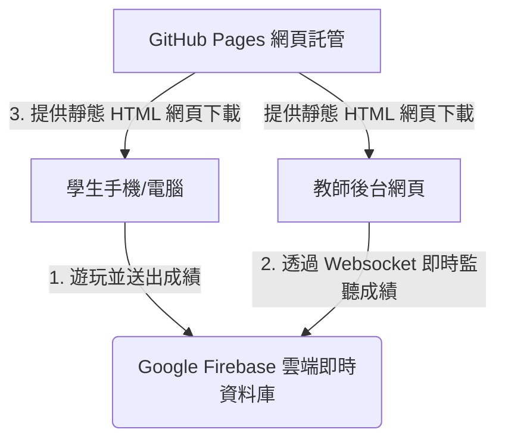

# 雲端單字闖關遊戲與後台管理系統：開發與部署複製指南

本指南詳細記錄了本套「無伺服器（Serverless）即時連網單字闖關遊戲」的完整開發流程與技術架構，以便您在未來能以最快速、正確的方式複製此模式到其他學科或教材中。

---

## 🏗️ 系統架構設計

本系統採用**完全無伺服器（Serverless）**的現代網頁架構，免去維護本地伺服器的繁瑣步驟，實現完全免費、零維護成本的部署：



---

## 🛠️ 複製本專案的五大核心步驟

如果您未來有一本新的單字書或學科教材，想要複製此模式，請遵循以下五個階段：

### 階段一：單字數據庫提取與預處理
1. **單字提取**：將教材 PDF/Word 中的單字提取，整理成結構化的 JSON 檔案（例如 `vocab.json`），格式如下：
   ```json
     {
       "rules": {
         // 允許讀取整個資料庫（以便後台能抓取所有學生成績與進度）
         ".read": true,
         
         "scores": {
           // 限制寫入：只允許「新增」成績，且欄位必須完全合法，不允許修改或刪除既有分數
           "$score_id": {
             ".write": "!data.exists() && newData.exists()",
             ".validate": "newData.hasChildren(['grade', 'seat_no', 'level', 'score', 'completed_at']) && 
                           newData.child('grade').isNumber() && newData.child('grade').val() >= 2 && newData.child('grade').val() <= 3 &&
                           newData.child('seat_no').isNumber() && newData.child('seat_no').val() >= 1 && newData.child('seat_no').val() <= 40 &&
                           newData.child('level').isNumber() && newData.child('level').val() >= 1 && newData.child('level').val() <= 49 &&
                           newData.child('score').isNumber() && newData.child('score').val() >= 0 && newData.child('score').val() <= 100"
           }
         },
         "students": {
           "$grade": {
             "$seat": {
               "unlocked_level": {
                 // 限制寫入：只允許學生更新自己的關卡數值（必須是 1-50 之間的數字）
                 ".write": "newData.isNumber() && newData.val() >= 1 && newData.val() <= 50"
               }
             }
           }
         }
       }
     }
   ```
2. **關卡規劃**：確定關卡分配邏輯（例如：每 2 頁為一個關卡，每關選出 20 個單字）。如果該關卡單字不足 20 個，則向後合併頁面，確保每關題庫充足。

---

### 階段二：紙本小考卷自動生成（選配）
使用 Python 的 `reportlab`（生成 PDF）與 `python-docx`（生成 Word）套件，讀取上述 JSON 資料庫：
1. **練習本**：生成包含英文、中文、注音與空格的 Word 檔，供學生手寫練習。
2. **正式小考本**：自動生成雙頁考卷（第一頁題目，第二頁教師答案卷），英文單字隨機排序，中文格線留白。
3. **純題目 PDF**：快速轉存 PDF 供平板派送。

---

### 階段三：Google Firebase 雲端資料庫建置與安全性防護（核心）
這是讓遊戲能夠連網、存取分數與進度的關鍵步驟（完全免費）：
1. **建立專案**：前往 [Firebase Console](https://console.firebase.google.com/) 點選「新增專案」，命名為 `my-vocab-game`。
2. **註冊網頁應用程式**：在專案內點選 `</>`（網頁圖示）註冊 App，獲得 **`firebaseConfig` 金鑰物件**（包含 `apiKey`, `projectId`, `databaseURL` 等）。
3. **啟用 Realtime Database**：
   * 在左側選單點選 **Build > Realtime Database**，點擊「建立資料庫」。
   * 選擇地區（如新加坡），安全性規則先選擇 **「以測試模式啟動」**（Start in test mode）。
4. **設定資料庫安全規則（防止資料被惡意刪除/修改）**：
   * 前往 **「規則」**（Rules）分頁，將預設規則替換為以下安全規則並點選「發佈」，只允許新增成績，且限制資料格式，杜絕惡意刪除：
     ```json
     {
       "rules": {
         "scores": {
           ".read": true,
           "$score_id": {
             ".write": "!data.exists() && newData.exists()",
             ".validate": "newData.hasChildren(['grade', 'seat_no', 'level', 'score', 'completed_at']) && 
                           newData.child('grade').isNumber() && newData.child('grade').val() >= 2 && newData.child('grade').val() <= 3 &&
                           newData.child('seat_no').isNumber() && newData.child('seat_no').val() >= 1 && newData.child('seat_no').val() <= 40 &&
                           newData.child('level').isNumber() && newData.child('level').val() >= 1 && newData.child('level').val() <= 49 &&
                           newData.child('score').isNumber() && newData.child('score').val() >= 0 && newData.child('score').val() <= 100"
           }
         },
         "students": {
           "$grade": {
             "$seat": {
               ".read": true,
               "unlocked_level": {
                 ".write": "newData.isNumber() && newData.val() >= 1 && newData.val() <= 50"
               }
             }
           }
         }
       }
     }
     ```
5. **設定 Google Cloud 金鑰限制（防止金鑰被挪用到其他網頁）**：
   * 登入 **[Google Cloud 控制台](https://console.cloud.google.com/)**，選擇您的專案。
   * 前往 **「API 和服務」 > 「憑證」**（Credentials），編輯您使用的 API 金鑰。
   * 在 **「應用程式限制」**（Application restrictions）中選擇 **「網站」**（HTTP 參照網址），加入您的 GitHub Pages 發佈網址（例如 `https://abel54575457.github.io/*`）並儲存。這能確保此 API 金鑰只能在您自己的網頁上運行！

---

### 階段四：網頁前端開發與題庫寫入
本系統由兩個獨立的 HTML 檔案組成：

#### 1. 學生遊戲端 (`單字闖關遊戲.html`)
* **SDK 引用**：透過 CDN 引入 Firebase 7.0+ 相容版 SDK：
  ```html
  <script src="https://www.gstatic.com/firebasejs/10.8.0/firebase-app-compat.js"></script>
  <script src="https://www.gstatic.com/firebasejs/10.8.0/firebase-database-compat.js"></script>
  ```
* **金鑰填寫**：將階段三獲得的 `firebaseConfig` 填入程式碼頂部。
* **動態生成題目**：
  * **隨機亂數種子**：使用 `Math.seedrandom` 或 Python 預先對每個關卡使用固定種子（如 `level + 5000`）隨機挑選 20 個單字，確保全班挑戰同關卡時題目一致。
  * **干擾項生成**：從同關卡的其餘單字中文翻譯中，隨機抽取 3 個作為錯誤選項（Distractors），並與正確答案混合打散（Shuffle）。
* **登入與解鎖機制**：
  * 使用 `localStorage` 儲存登入的年級與座號，避免網頁重整時登出。
  * 分數大於等於 85 分時，將雲端路徑 `/students/grade_X/seat_Y/unlocked_level` 數值加 1，解鎖下一關。
* **即時排名 PK 功能**：
  * 監聽 `/scores` 數據，過濾出「同年級」所有學生的成績。
  * 統計同級學生在各關的最高分，使用「排名 = 比我高分的人數 + 1」公式計算名次，並以金🥇、銀🥈、銅🥉勳章動態顯示於解鎖關卡卡片上。

#### 2. 教師後台端 (`單字後台管理.html`)
* **資料同步**：使用 `db.ref().on('value')` 監聽資料庫根節點。一旦有學生送出分數，後台網頁**無須整理即時更新**。
* **雙模式切換**：
  * **總覽模式**：以 HTML5 進度條展示每位同學解鎖進度（49 關完成百分比）。
  * **單關檢視**：下拉選單選取特定關卡，即時拉取該關卡所有同學的通關狀態與歷次挑戰分數。
* **Excel 匯出**：
  * 引入 SheetJS 庫：
    ```html
    <script src="https://cdn.jsdelivr.net/npm/xlsx@0.18.5/dist/xlsx.full.min.js"></script>
    ```
  * 當點選「匯出 Excel」時，JS 會在瀏覽器內動態重組資料，產生包含「年級、座號、解鎖進度、1~49關各自最高分」的二維陣列，並直接觸發瀏覽器下載 `.xlsx` 檔案，格式完美對齊。

---

### 階段五：GitHub Desktop 自動化同步部署
1. **建立 GitHub 儲存庫**：在 GitHub 上新建一個 **Public（公開）** 的 Repository。
2. **安裝與 Clone**：
   * 安裝 [GitHub Desktop](https://desktop.github.com/) 並登入帳號。
   * 將剛剛建立的線上儲存庫 Clone 到電腦的本地資料夾。
3. **放置檔案**：將寫好連線金鑰與題庫的 `單字闖關遊戲.html` 與 `單字後台管理.html` 放入該克隆資料夾中。
4. **開啟網頁託管**：
   * 前往該專案在 GitHub 網站的 **Settings > Pages**。
   * 在 Branch 欄位將 `None` 改為 **`main`**，後方保持 `/ (root)`，點選 **Save**。
5. **一鍵同步**：未來在電腦上修改檔案後，只需開啟 GitHub Desktop，填寫 Commit 說明，點選 **Commit to main** 再點選 **Push origin**，GitHub 網頁便會在 30 秒內自動更新上線！

---

## ⚡ 快速複製檢核清單（10分鐘速成法）

當您要為「新課本」製作遊戲時：
- [ ] 1. 整理新單字表，存成 JSON 格式。
- [ ] 2. 建立一個新的 Firebase 專案，開啟 Realtime Database 並設為測試模式（`true`）。
- [ ] 3. 複製 `單字闖關遊戲.html` 與 `單字後台管理.html`。
- [ ] 4. 修改兩份檔案底部的 `firebaseConfig`，替換成新專案的金鑰。
- [ ] 5. 用 Python 讀取新 JSON，將題庫字串替換掉網頁中的 `CONST_LEVELS_PLACEHOLDER`（後台管理端無須包含題庫，只需改連線金鑰）。
- [ ] 6. 放入 GitHub 本地資料夾，使用 GitHub Desktop 推送（Push）上網。
- [ ] 7. 開啟網頁即可開始遊玩與管理！
